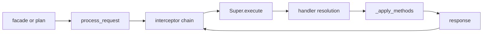
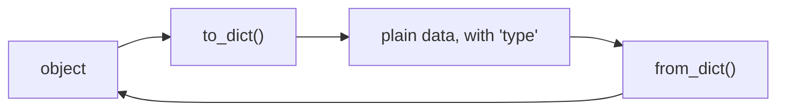

# Architecture

Three layers and a rule: **a request is data**, and everything reaches the model by sending one
to a single orchestrator.

That rule is what the rest follows from. A call cannot be logged, replayed, queued, sent over a
wire or scheduled against other calls without inventing a description of it first; a request
already is that description.

## The layers

| Layer | Depends on | Holds |
| --- | --- | --- |
| **Base** | nothing | `Serializable`, `BaseEntity`, `BaseContainer[T]` — validation, serialization, caching, ownership |
| **Super** | Base, and a `MethodProvider` | `Super` and its handlers, the five built-in operations, `Project` |
| **Mega** | Base and Super | `Manipulator` — the registry, requests, batches, pipelines, facades |

The Super layer does not import the Mega layer. It needs one method from whatever drives it —
`get_methods_for_type` — and says so as a `Protocol`, so a `Super` can be driven by a test stub.

Around the three:

| | |
| --- | --- |
| `interceptors.py` | Metrics and a request journal, both ordinary interceptors |
| `catalogue.py`, `model.py`, `scaffold.py` | What is registered, what holds what, generated stubs |
| `errors.py` | The exception taxonomy |
| `utils/` | Logging and the validation helpers |

## What happens to a request

1. A facade, a batch or a pipeline step produces a request dictionary.
2. `process_request` validates its shape and finds the `Super` registered for the operation.
3. The interceptor chain wraps the dispatch, outermost first. Each may observe, time, refuse or
   rewrite.
4. `Super.execute` resolves a handler: the requested name, then `_<operation>_<name>`, then
   `_<operation>_<type>`, then `_<operation>_basecontainer`, then `_<operation>`.
5. The handler usually calls `_apply_methods`, which applies each method the request named.
6. A response comes back in one shape, whatever happened.

A pipeline is the same path once per step, plus the edges: substitution happens before the chain,
so an interceptor never sees an unresolved reference.

## Why a container is not an entity

`BaseEntity` and `BaseContainer` are siblings, both deriving from `Serializable`.

They spell different things with the same words. `entity.get("field")` reads an attribute;
`container.get("name")` returns an item. While the container inherited from the entity, each of
those names carried two incompatible meanings inside one hierarchy.

Making them siblings separated the types; the names had to follow. `clear()` meant three things
across the framework -- null an entity's attributes, drop a container's items, release the
references a `Super` holds -- so each is now `reset_attributes()`, `remove_all()` and `release()`.
One name for one job, checkable by reading it.

`Serializable` holds what they genuinely share: annotated fields and their validation, `name` and
`isactive`, `to_dict`, the cache, ownership, `revision` and `fingerprint`. It is also the type to
use in an `isinstance` check that should accept either.

## Derivation instead of declaration

An application otherwise says what it can do twice — once in the handlers, once in the menu that
offers them — and the second copy goes stale.

| Question | Answered from | Through |
| --- | --- | --- |
| What operations exist, with what handlers | The registry and the handler names | `describe_operations()` |
| Which handler needs which | Calls between handlers, read from the source | `order_handlers()`, `requirements_of()` |
| What attributes a handler takes | The keys it reads out of them | `describe_operations()`, as `accepts` |
| Which type holds which, and what a change reaches | The annotations | `describe_model()`, `dependents_of()` |
| What handlers a new operation would need | The model graph | `scaffold()` |

Three limits. Reading source means a handler attached to a class after import is invisible. What
a handler touches *outside* its operation is an upper bound, because a shared helper is followed
for every handler that calls it — good for checking a declaration, not for replacing one. And
`accepts` errs the other way: a key read under a name computed at run time is not seen, so it
says what to offer rather than what to refuse.

## Serialization

The annotation is the schema. JSON has no set, no tuple and no entity, so what comes back is a
list or a mapping and only the declared type says which it was. A mapping carrying `type` is
restored through the class it names, so a subclass stored in a field typed as its base comes back
as the subclass.

Cycles are marked rather than followed. A class that has versioned itself writes
`schema_version` and migrates old data forward; one that never has writes exactly what it always
wrote.

## Errors

Every exception derives from `MSBError`, and also from the built-in it replaces, so `except
TypeError` keeps working while `except DuplicateNameError` becomes possible.

A response carries `error_type` — a name, not an exception, because a response is data — so a
facade re-raises the kind of failure that happened rather than flattening everything into one.
The traceback does not survive that boundary.

## Extension points

| To | Do |
| --- | --- |
| Add a type | Write a `BaseEntity` or `BaseContainer` subclass. Nothing else changes |
| Add an operation | Write a `Super`, register it. A facade appears |
| Change one type's behaviour in an existing operation | Add `_<operation>_<type>` to a subclass of the built-in and register it |
| Change the file format | Register your own `save` and `load` |
| Watch, refuse or rewrite requests | Add an interceptor |
| Drive it from somewhere else | Send requests. A plan is data too |

## Performance

Anything decided per class is worked out once per class: resolved annotations, compiled
validators, which fields are written, what a method takes, the parsed source behind the
catalogue, the model graph. Measured effects of doing that are in the changelog for 1.3.0.

A single object is not thread-safe, exactly as a plain Python object is not. What MSB shares
between objects — the class tables, handler resolution, the traversal marks used by `to_dict` —
is guarded.
