# Diagrams

The mechanisms, drawn. Prose for each is in [architecture.md](architecture.md).

## The layers

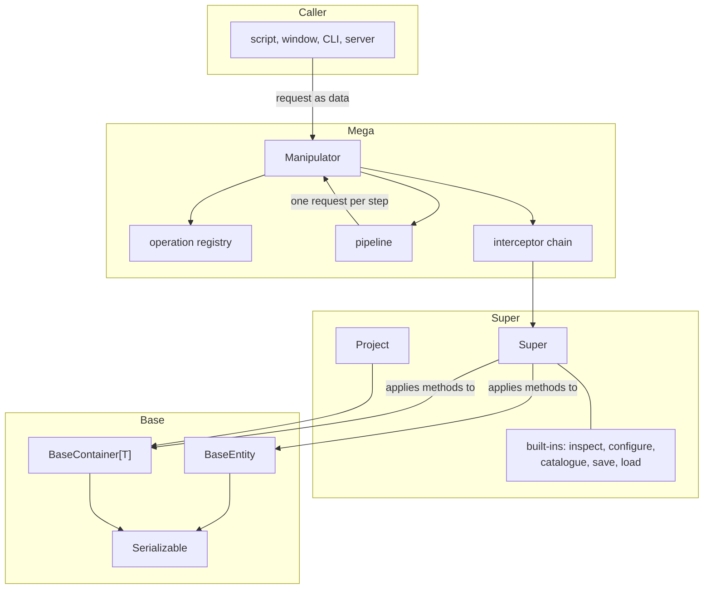

The Super layer never points upward: it needs one method from whatever drives it, declared as the
`MethodProvider` protocol.

## Class hierarchy

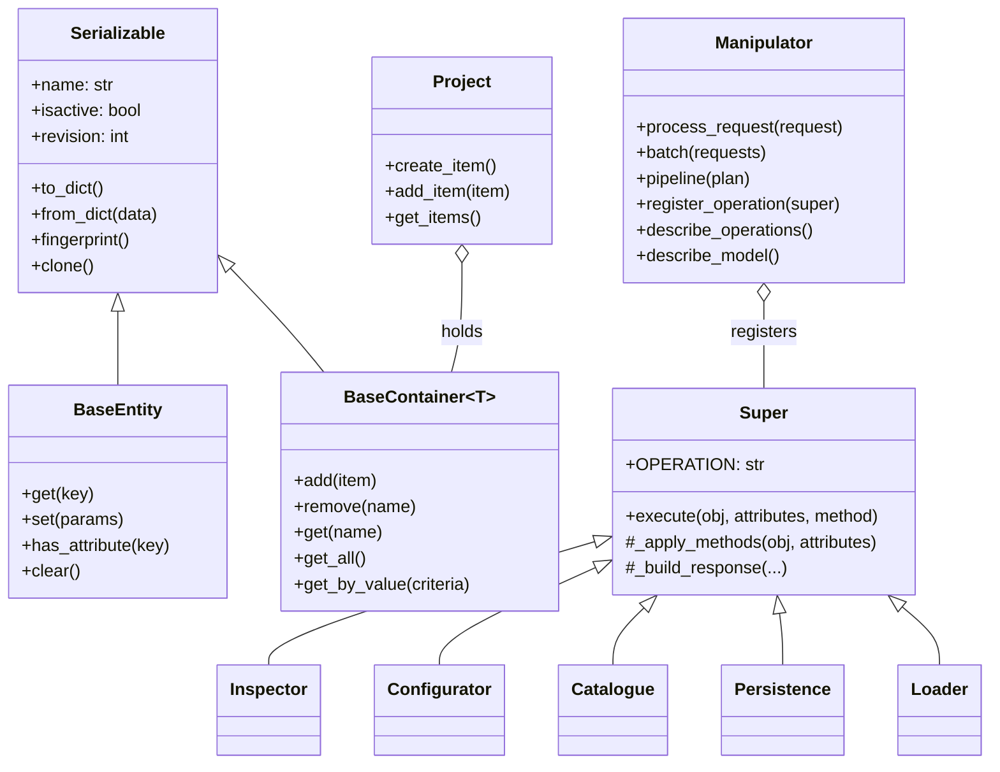

`BaseEntity` and `BaseContainer` are siblings: `get`, `set` and `clear` mean different things to
each.

## One request

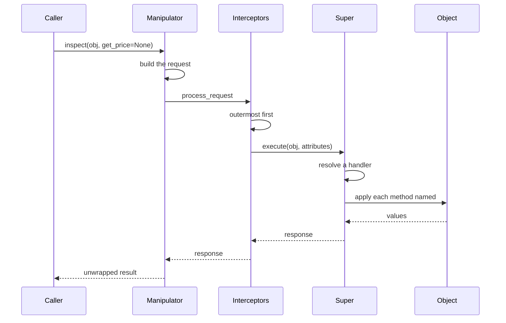

An interceptor may return a response without calling the next one, which is what refusing looks
like.

## Choosing a handler

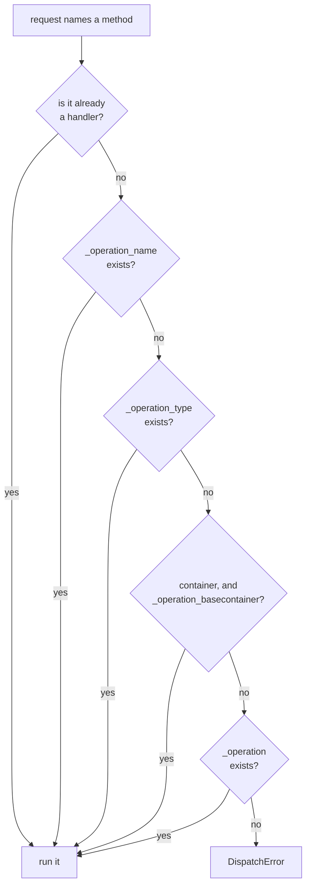

Only handlers of the operation are reachable. A name outside it falls through to a more general
handler rather than being called.

## A pipeline

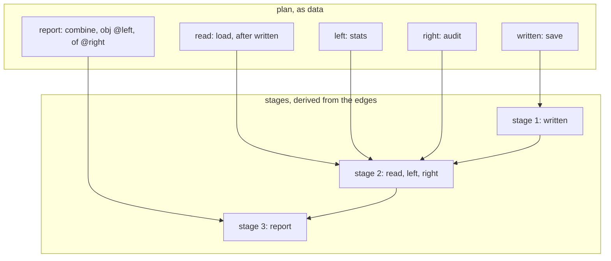

Steps in one stage wait for nothing outside the stages before it, so they may run together.
Every step is still one `process_request`.

When a step fails, the branch below it is skipped and the rest still runs:

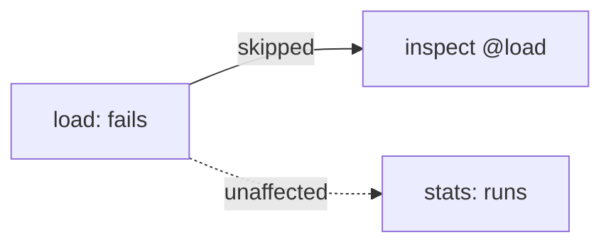

## Serialization

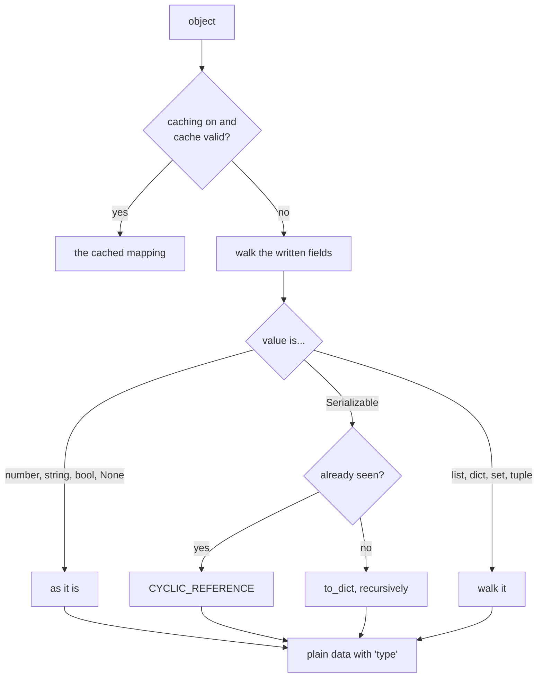

Restoring reverses it, guided by the annotation: the declared type is what says a list was a
tuple or a set.

## Validating a value

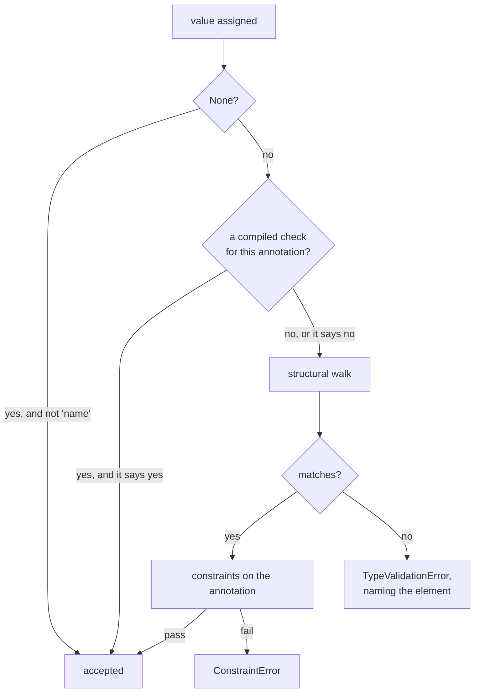

The compiled check is a fast path for the shapes most models are made of. A refusal always goes
through the walk, so the message names what failed.

## Invalidating a cache

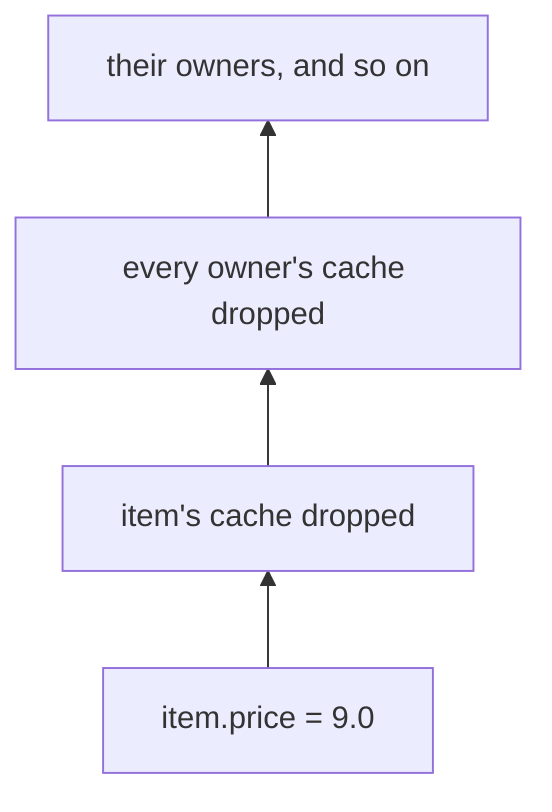

Invalidation walks up the ownership graph, because a container serialises its items. Ownership is
recorded when an object is assigned to a field or added to a container, and owners are held
weakly.

## What the orchestrator derives

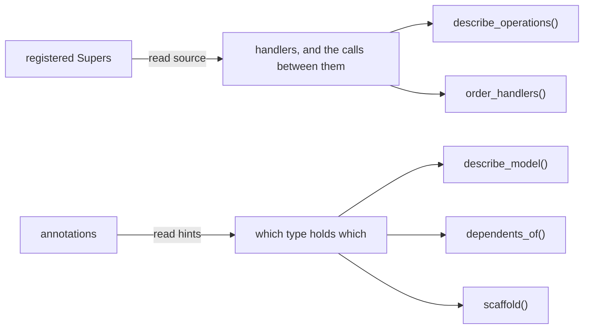

Nothing here is written down twice, so a menu or a diagram built from it cannot go stale.

## A project

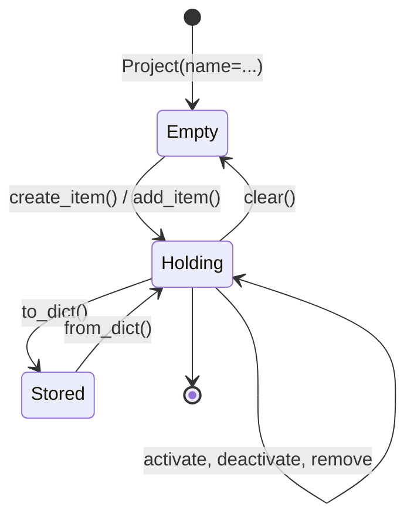
